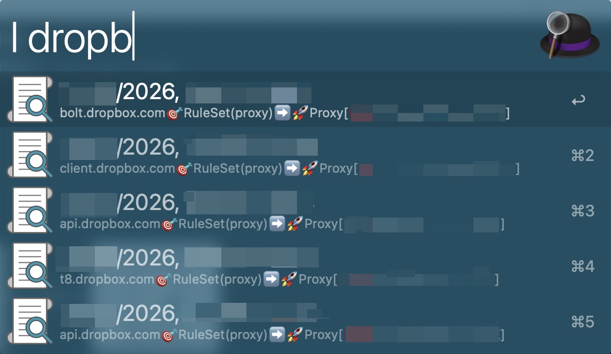

# 🔍 Alfred Log Searcher

An Alfred workflow to search Clash of Clans logs with instant results.

- [📸 Screenshot](#-screenshot)
- [📥 Installation](#-installation)
- [🕹️ Usage](#️-usage)

## 📸 Screenshot

## 📥 Installation

1. Download the [latest release](https://github.com/hunterMG/alfred-log-searcher/releases/latest), open it with `Alfred 5.app`.
2. Set the log directory or use the default.

## 🕹️ Usage

1. Show results in Alfred: type your keyword into Alfred (default: `l`) and provide a query to see instant search results from logs. The most recent entry is displayed at the top.
2. Show results in Console.app: type your keyword into Alfred (default: `cl`) and provide a query then hit `Enter`.
